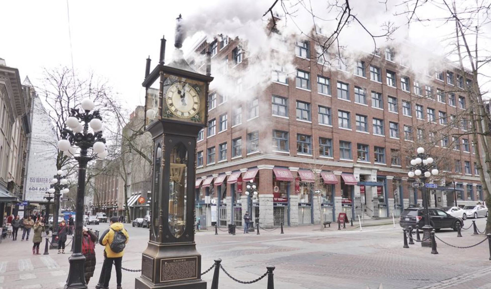
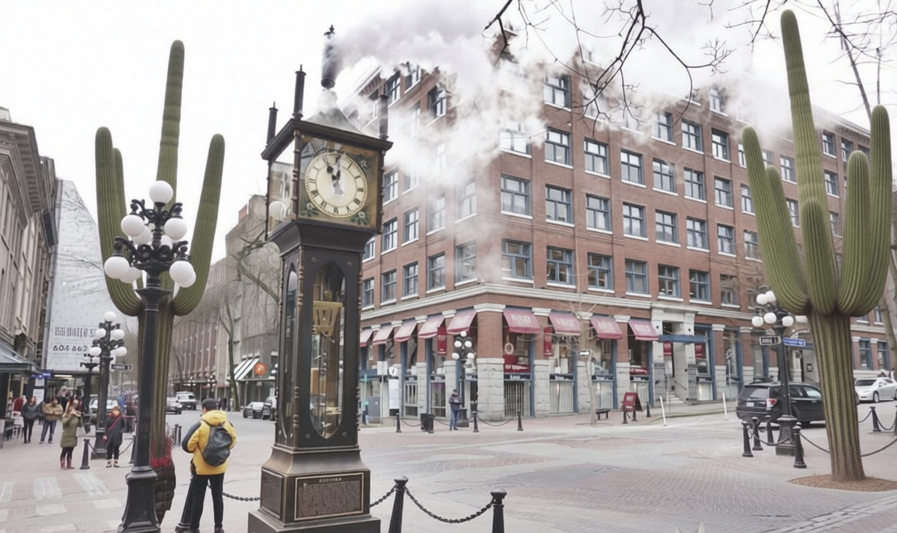

# GeoConflict: Geography Conflict Image Generation Pipeline

GeoConflict generates **geographically conflicting image edits** by combining incompatible elements from different climates, regions, or cultural contexts into a single scene.

## Example: Vancouver

**Input**: Original Vancouver Gastown Steam Clock


**Output**: Same scene with saguaro cacti (desert plants)  


**Geographic Logic**:
- Vancouver = Temperate rainforest climate (cool, wet)
- Saguaro cacti = Sonoran Desert plants (hot, arid)
- **Conflict**: Desert flora in rainforest city

## Quick Start

```bash
# Setup
git clone <repo-url> && cd GeoConflict
conda create -n geoconflict python=3.10
conda activate geoconflict
pip install -r requirements.txt

# Set API keys
export OPENAI_API_KEY="your_key"
export DASHSCOPE_API_KEY="your_key"

# Run example
python run_pipeline.py
```

## Architecture

- **OpenAI GPT**: Geographic understanding and instruction generation
- **FAISS RAG**: Retrieval of geographically incompatible concepts  
- **DashScope/Qwen**: Visual realization of conflicts
- **Modular Design**: Clean separation of models, prompts, rag, configs

## Key Features

- **Geographic Awareness**: Climate/ecosystem-based conflict generation
- **Visual Coherence**: Maintains lighting and atmosphere consistency
- **Multiple Conflict Types**: Flora, climate, architectural, cultural
- **Reproducible**: Configuration-driven experimental workflows

## Requirements

```txt
numpy<2
openai>=1.0.0
dashscope
faiss-cpu
pillow
requests
pyyaml
```

---

**Note**: For academic research and educational purposes only.
