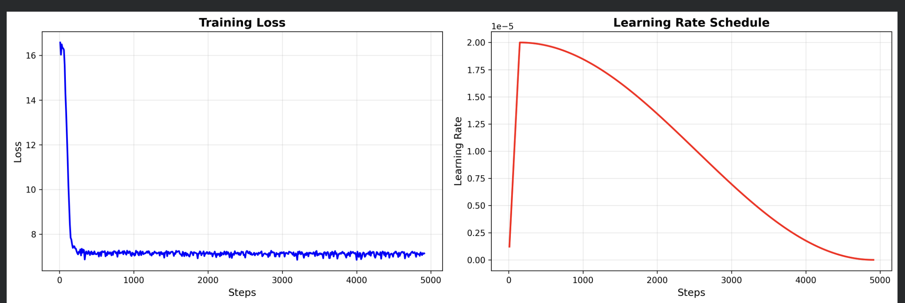

# GeoLocRAG
CS 762 Deep Learning project. Learn to geolocate with retrieval and reasoning.

## Project Summary

GeolocRAG combines retrieval-augmented pipelines and language-model reasoning to infer geographic location from visual and textual clues. The repository contains code for building a retrieval index, finetuning and running reasoning models, inference scripts for both baseline and finetuned models, and evaluation utilities.

## Key Files and Directories
-`GeoLocPipeline.py` :End-to-end pipeline tying retrieval, reasoning, and inference together.
- `infer.py`: Baseline inference script for running model predictions.
- `infer_finetuned.py`: Inference wrapper that loads a finetuned model and runs predictions on inputs.
- `rag_retrive_builder.py` & `ragpipe.py`: Build or update the retrieval index from datasets.
- `reasoningLM.py`: Wrapper/utilities for the reasoning language model component.
- `finetune_qwen.py`: Qwen-specific finetuning utilities and entrypoints.
- `index.index`: Prebuilt retrieval index — skip rebuilding if up-to-date.
- `edit.py`: Utility for preparing or editing datasets/configurations.
- `eval.py`: Evaluation script — compares predictions to ground truth and computes project metrics (distance error, accuracy@k, etc.).
- `finetune.py`: General finetuning script for model training.

- `train_geo_reasoning.sh`: Shell script to launch geolocation reasoning model training (often contains training flags for distributed runs).
- `qwenvldownload.py`: Helpers to download Qwen-related datasets or checkpoints.
- `finetune_scripts/`: Collection of experimental finetuning notebooks and helper scripts (LoRA, CLIP, etc.).
- `output/`: Contains tokenizer, adapter, and checkpoint artifacts (e.g., `adapter_model.safetensors`, `tokenizer.json`, `checkpoint-*`). These can be used for inference.
## Run / Evaluate — High-level Template
Replace placeholders and confirm each script's CLI flags (they may differ slightly). Example workflow:

1) Prepare environment

```bash
python -m venv .venv
source .venv/bin/activate
pip install -U pip
pip install -r requirements.txt
# Or install core packages manually if requirements is missing:
pip install transformers accelerate sentence-transformers datasets peft deepspeed pillow huggingface_hub scipy
```

2) Prepare retrieval index

- If `index.index` exists and is current, you can skip rebuild.
- To (re)build (adjust flags as needed):

```bash
python rag_retrive_builder.py \
	--data-dir /path/to/dataset \
	--out index.index \
	--embedding-model sentence-transformers/your-model
```

3) Run inference (single example or batch)

- Baseline / non-finetuned:

```bash
python infer.py \
	--input path/to/input.jsonl \
	--index path/to/index.index \
	--output preds_baseline.jsonl
```

- Using a finetuned checkpoint:

```bash
python infer_finetuned.py \
	--checkpoint output/checkpoint-4914 \
	--index path/to/index.index \
	--input path/to/input.jsonl \
	--output preds_finetuned.jsonl
```

- Run the full pipeline (if available):

```bash
python ragpipe.py --config configs/my_run.yaml --output pipeline_preds.jsonl
```


4) Evaluate predictions

```bash
python eval_simple.py --base_model /content/drive/MyDrive/Navig/fine_tune/Qwen2-VL-7B    --adapter /content/drive/MyDrive/Navig/output  --test_data train.jsonl --output eval_results.json --max_samples 500
```

- Run evaluator for the RAG pipeline
```bash
python rag/eval_geo.py \
 --rag_index_path /content/drive/MyDrive/Navig/rag/index.index \
 --rag_base /content/drive/MyDrive/Navig/data/guidebook \
 --reasoner_model_path /content/drive/MyDrive/Navig/fine_tune/Qwen2-VL-7B \
 --inference_model_path /content/drive/MyDrive/Navig/fine_tune/Qwen2-VL-7B  \
--inference_adapter_path /content/drive/MyDrive/Navig/output \
--test_data ./rag/train.jsonl \
--output  eval_result_rag.json \
--max_samples 500
```

Adjust the CLI flags if `eval.py` uses different argument names — open the script to confirm exact usage.

5) Train / Finetune

- Quick shell-run:

```bash
python finetune_qwen.py \
    --model_name_or_path /content/drive/MyDrive/Navig/fine_tune/Qwen2-VL-7B \
    --data_path /content/drive/MyDrive/Navig/fine_tune/finetuneqwen.jsonl \
    --output_dir /content/drive/MyDrive/Navig/output \
    --use_lora \
    --num_train_epochs 3 \
    --bf16
```

6) Reproducibility checklist

-  make sure to have the dataset placed in the following manner
- / data / NaviClues - for finetune data
- /data/guidebook  -  for the ragpipline
- use index.paths  - for the ragfile path founder

## Notebooks — 

These are interactive/experimental notebooks that are useful for exploration but are not required for batch or CI-style runs:

- `Navig.ipynb` — exploratory analysis and visualization.
- `test_fintune_infernce.ipynb` — interactive debugging of finetuned inference.
- `test_retrival.ipynb` — retrieval experiments and ad-hoc checks.
- `finetune_scripts/Qwen_finetwen_with_naviclues_datasest.ipynb` — Main experimental run on GoogleColab  LoRA/CLIP finetuning notebooks;

## RAG and Adapter weights

- Confirm exact CLI flags by opening `infer.py`, `infer_finetuned.py`, and `eval.py` before running — script signatures may vary.
- If `index.index` rag vector dataset embeding `Plon kt` Dataset.
- `output/` contains artifacts that can be used directly for inference (tokenizer, adapters, checkpoints).

## Image Results

This project produces visual outputs to help inspect model predictions. Below are results from finetuned models on the NaviClues dataset:

### Finetuned Qwen2-VLM with NaviClues



This visualization shows the performance of the finetuned Qwen2-VLM model trained on the NaviClues dataset. The model learns to predict geographic locations from visual clues in the images.

### Infernce

!python infer_finetuned.py --base_model_path /content/drive/MyDrive/Navig/fine_tune/Qwen2-VL-7B    --adapter_path /content/drive/MyDrive/Navig/output  --image_path /content/drive/MyDrive/Navig/data/inferenceImages/madison-coconuts.png

#### Madison Results
| Original Image | Model Prediction |
|---|---|
|  |  |

This result displays prediction accuracy and error distribution for the Madison area test set, showing how well the model generalizes to specific geographic regions.

#### MIT Results
| Original Image | Model Prediction |
|---|---|
|  |  |


### Eval
!python eval_simple.py --base_model /content/drive/MyDrive/Navig/fine_tune/Qwen2-VL-7B    --adapter /content/drive/MyDrive/Navig/output  --test_data train.jsonl --output eval_results.json --max_samples 500

### Visualization Commands

To generate similar visualizations after running inference:

```python
from PIL import
im = Image.open(img_path)
im.show()
```

### Output Schema

Typical inference predictions are stored in JSONL format with the following fields:

```json
"results" :{
  "country": "path/to/image.jpg",
  "pred_lat": 43.0757,
  "pred_lon": -89.4070,
  "continent": "North America",
  "latitude":,
  "longitude":
   "
}
```

[500] /content/drive/MyDrive/Navig/data/google_street_view/Images/Atlanta_ (33.744082, -84.420212).jpg
Generating location deduction...
```json
{
  "result": {
    "continent": "North America",
    "country": "United States",
    "city": "Atlanta",
    "latitude": 33.8488,
    "longitude": -84.3884
  }
}
```

```
{'country': 'United States', 'city': 'Atlanta', 'continent': 'North America', 'latitude': 33.8488, 'longitude': -84.3884, 'reasoning': '```json\n{\n  "result": {\n    "continent": "North America",\n    "country": "United States",\n    "city": "Atlanta",\n    "latitude": 33.8488,\n    "longitude": -84.3884\n  }\n}\n```'}
    Distance: 12.0 km | Score: 4970 | City: ✓ | Country: ✓
```


